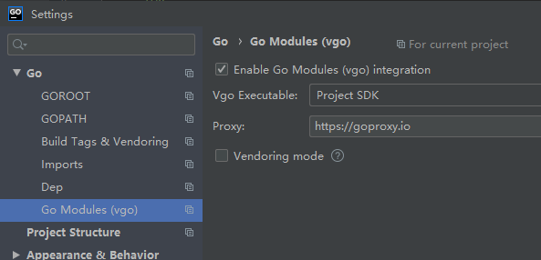

### 官网地址
https://golang.google.cn/

### 安装及环境配置
>1.设置环境变量  
- GOROOT = 安装目录
- GOPATH = 工作区（go程序起始位置）
- 将%GOROOT%\bin配置到PATH中
>2.go mod 配置
- GO111MODULE = on
- GOPROXY = https://goproxy.io
- goland 配置   

 
### gui桌面程序编译命令
```
go build  -ldflags="-s -w -H windowsgui"
```

### 框架收集
- 1、fyne (GUI 框架开发包) [github](https://github.com/fyne-io/fyne)
